# Clock Radio Exercise

## Clock Radio
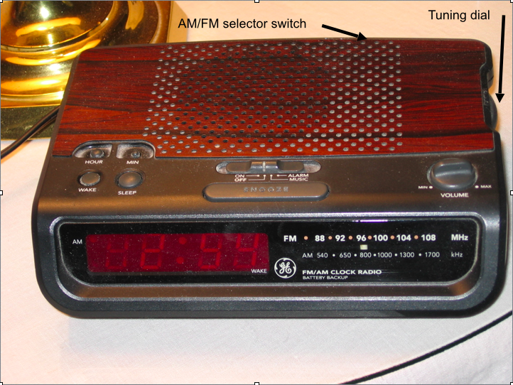
- Radio is powered by electricity from a wall socket
- Controlled by two manual knobs, one for volume and one for tuning
- Chosen frequency is displayed on the right side of the front panel
- Display features a 12-hour clock and two small lights
	- Light in the upper lefthand corner: displayed time AM / PM
	- Light in the lower righthand corer: lit -> armed the alarm
- Switches
	- One of the switches: frequency band AM / FM
	- Second switch has four positions
		- Switch slides horizontally from left to right
		- Positions indicate whether the radio is: *On*, *Off*, *Armed for wake by the radio* or *Armed for wakeup via a beeping sound*
- Four butons can be used to set various timers in the clock ("Hour", "Min", "Wake" and "Sleep")
	- "Wake": set the time you wish the alarm to go off
	- "Sleep": set how long you would like the radio to play (allow you to fall asleep with te radio playing)
	- Other two buttons ("Hour", "Min"): can set 3 timers
- Snooze button: shuts off alarm for 10 minutes
- Alarm automatically turn itself off after one hour (to prevent it being audible all day)

## Use cases
- Setting the time
- Changing frequency
- Pressing "Snooze"
- Etc.

## Percepts
- Speaker
- Time display
- Indicator lights
- AM/FM
- Position of turning knob
- Horizontal position of vertical frequency bar
- Rotational position of volume dial
- Current setting of the swith AM/FM
- Current setting of slide switch (on/off, radio, alarm)

## How many states can each percepts be in

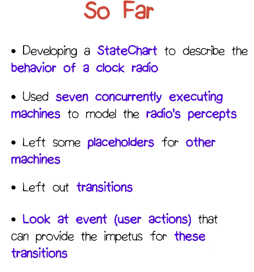
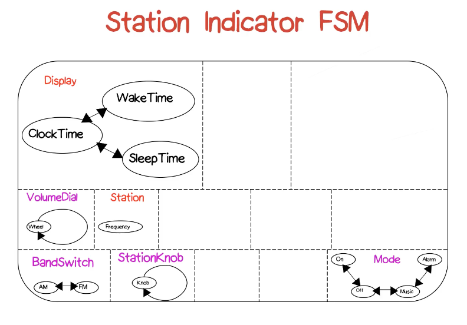

## Behavior
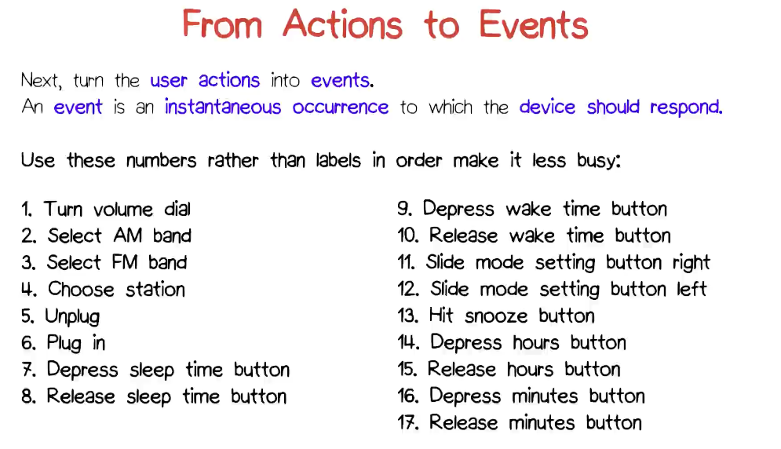

*Outer most layer of the clock radio's states*
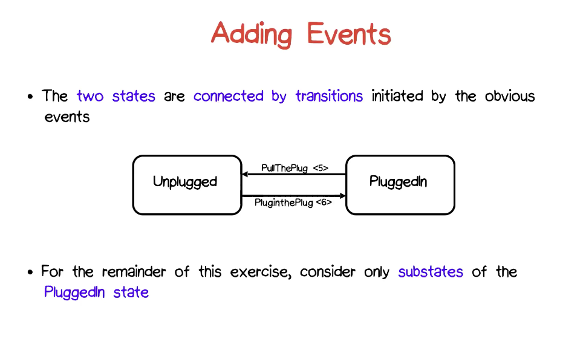

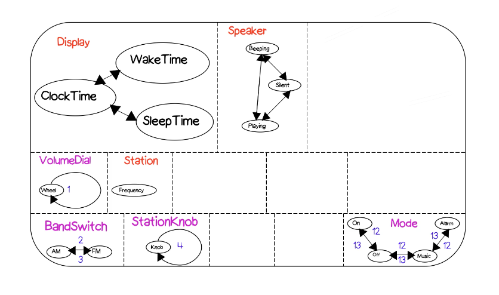

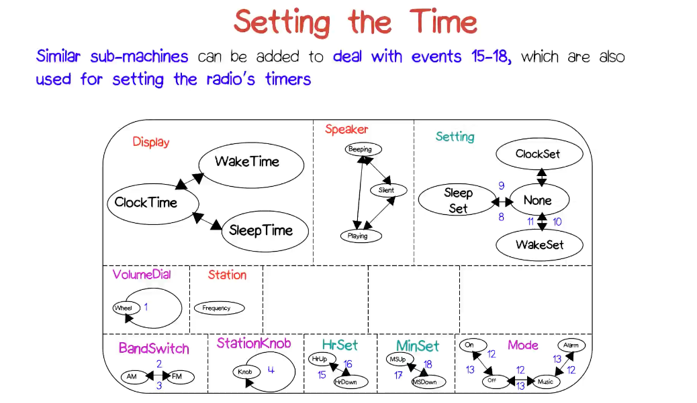

## Response to events
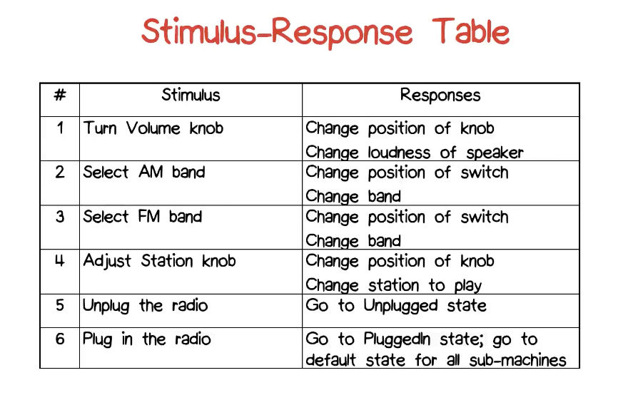

## Add additional state machines: Internal timers
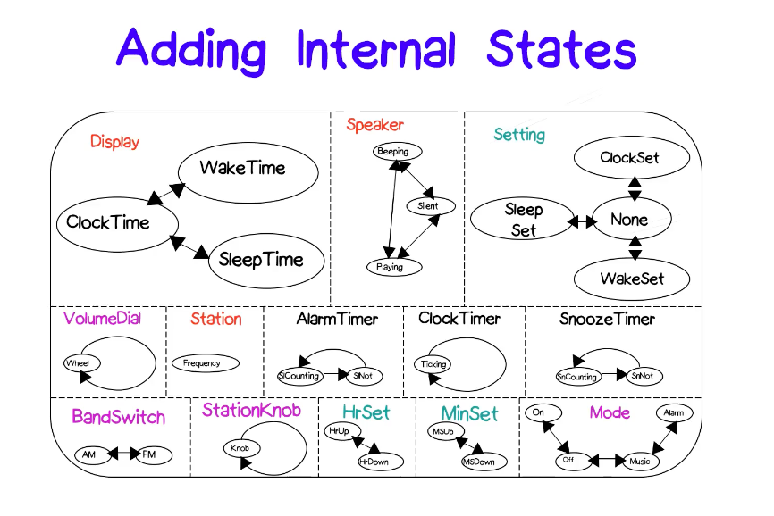

*Other internal events*
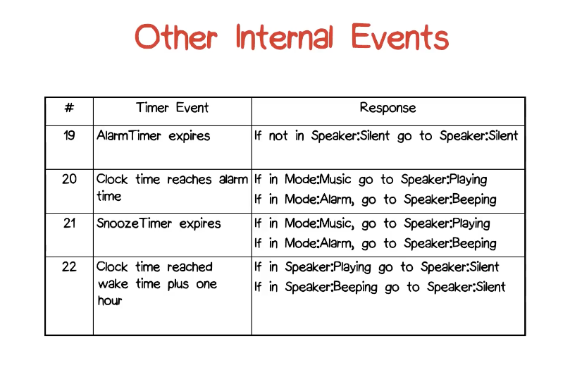

## Guarded transition
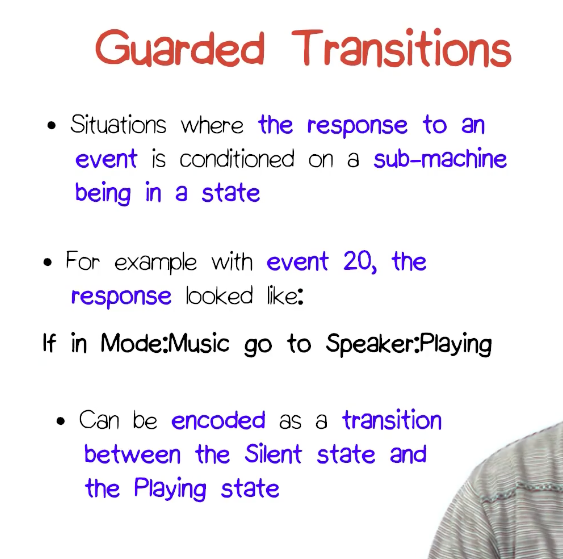
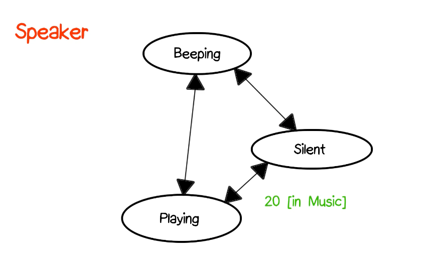

## Cascaded events
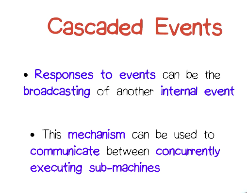

## Still need to do
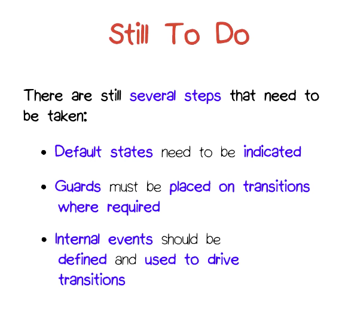

## Final diagram
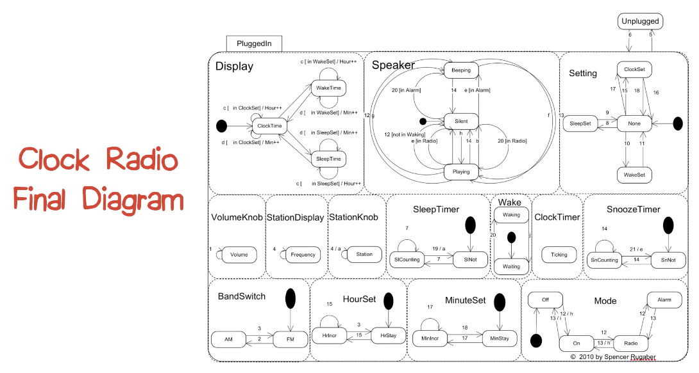

*Validation*
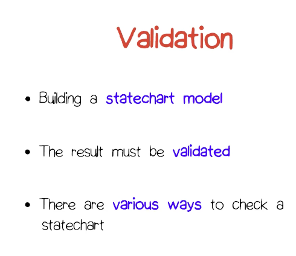

## Statechart Modeling Methods
1. Prepare usage scenarios
2. Determine external percepts
3. Model percepts with states
4. Determine external controls and stimuli
5. Model with additional states and transitions/events
6. List stimulus/response(s) pairs
7. Add necessary internal states (e.g. timers)
8. Provide coordination mechanisms
9. Add actions/activities
10. Validate resulting machine v.s. scenarios

