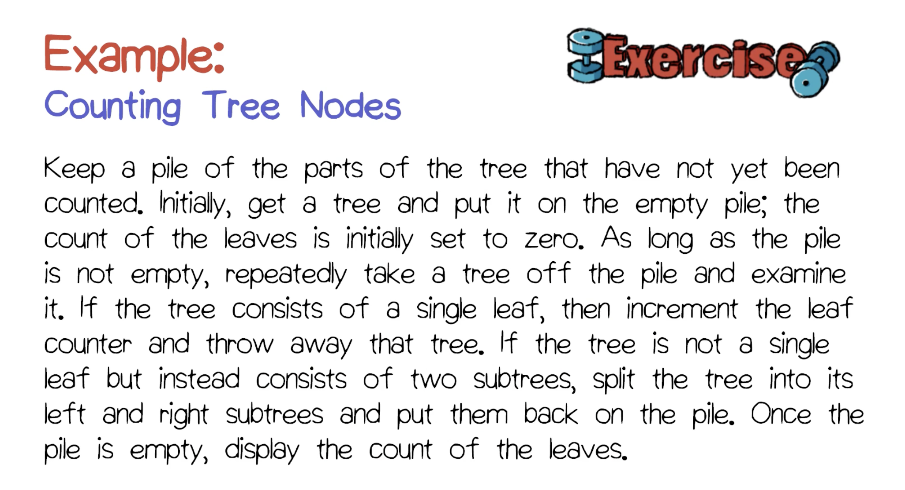
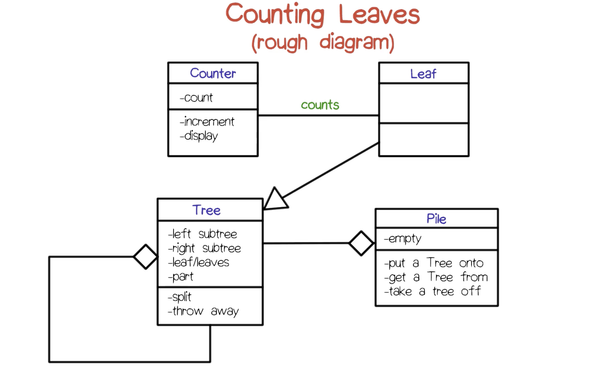

# Object Oriented Analysis

## Key points
- Requirements analysis technique
- Modeling real-world objects based on their descriptions
- Produce object analysis model
- Express these models using UML class model diagrams
- History:
	- Developed by Abbott and Booch in the 1980s
	- OOA pays primary attention to data **objects**
	- Prior to OOA, the predominant method was strctured design (also called functional decomposition or FD): functionally oriented
	- Advantage of OOA: *During maintenance, functions change more frequently than objects*

## OOA description
- Takes a texual description of a system to be built (e.g. requirements document), looks for different kinds of words such as nouns, verbs and adjectives
- Goal: use identified words to build up descriptions of classes and their relationships
	- Nouns -> classes
	- Actions -> operations
	- Adjectives -> attributes
	- Stative verbs -> relationships
- Steps:
	1. **Candidate object classes** are indicated by the occurance of **nouns** in the natural language description of the system to be built
	2. The **nouns** can then be organized into related groups termed **classes**
	3. The next step looks for **adjectives**, which often indicate properties that can be modeled as **attributes**
	4. Subsequently, **action verbs** can be modeled as **operations** and assigned to an appropriate **provider class**
	5. Other **stative verbs** are indicative of **relationships** among classes
- Technique
	- Obtain or prepare texual description of problem
	- Underline all nouns
		- Issues: some words are duplicates, some words share the same stem
		- Solution: stemming (remove prefixes and postfixes / suffixes to the words, use root word as corresponding candidate and class)
		- Organize the nouns into groups to become candidate classes
			- Groups form candidate classes. A class is a description of a group of related objects (also called instances)
	- Underline all the adjectives
		- Assign the adjectives as attributes of the candidate classes
	- Underline the verbs, differentiating action from stative verbs
		- Assign action verbs as operations of classes
		- Assign stative verbs as attributes of classes or relationships
- Caveat
	- Conclusions that are reached are always tentative
	- Questions may arise requiring research or going back to customers
	- The overall process is inherently incremental

## Exercise: counting tree nodes
- 
- Operations in classes
	- Pile class operations:
		- Put a tree onto
		- Get a tree from
		- Take a tree off
	- Counter class operations:
		- Increment
		- Display
	- Tree class operations
		- Split
		- Throw away
- Relationships
	- Indicated by lines connecting classes adorned in one of three ways
		- Generalizations: --|>
			- Indicates that instances of one of the two classes (the child class) are kind of instances of the other class (the parent class)
			- Words like *is a*, *kind of* and *type of* indicate the generalization relationship
			- Class names themselves can serve as indicators
		- Aggregations: --<>
			- Colletions of some sort
			- Heralded in text by words like *consists of*, *part of*, *contains*, *has*, *incorporates*, and *belongs to*
		- Associations: ---
			- More general
			- Stative verbs denote a state of being and often indicate associations
	- Relationship issues
		- All of the classes are really a part of an overarching TreeCountingSystem class (not normally displayed in those diagrams)
		- The textual description was not truly characteristic of typical requirements documents
		- In general, it is important to distinguish the **analysis** and **design** phases of a software development effort in order to avoid prematurely bias the approach taken towards solution.

- 

