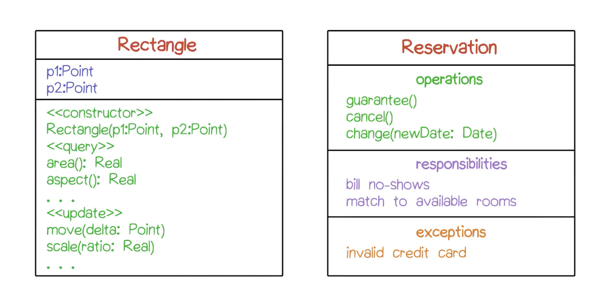
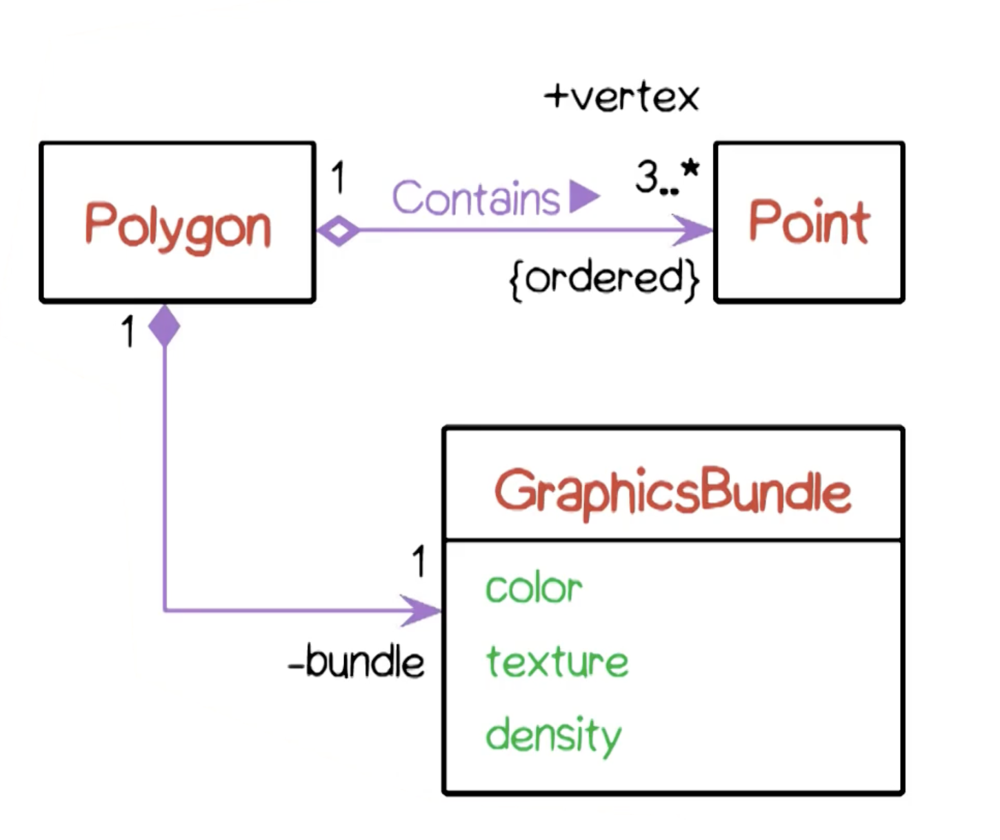
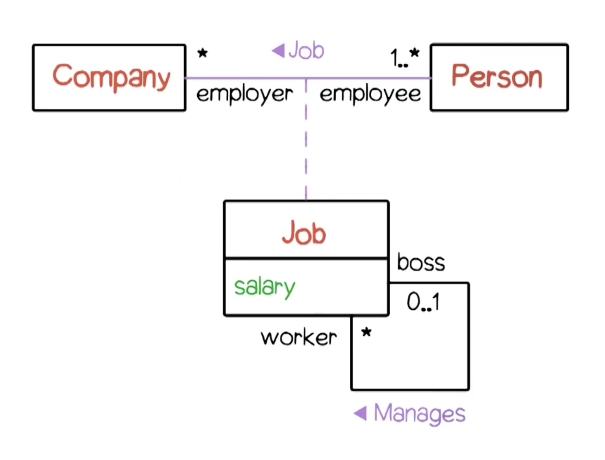
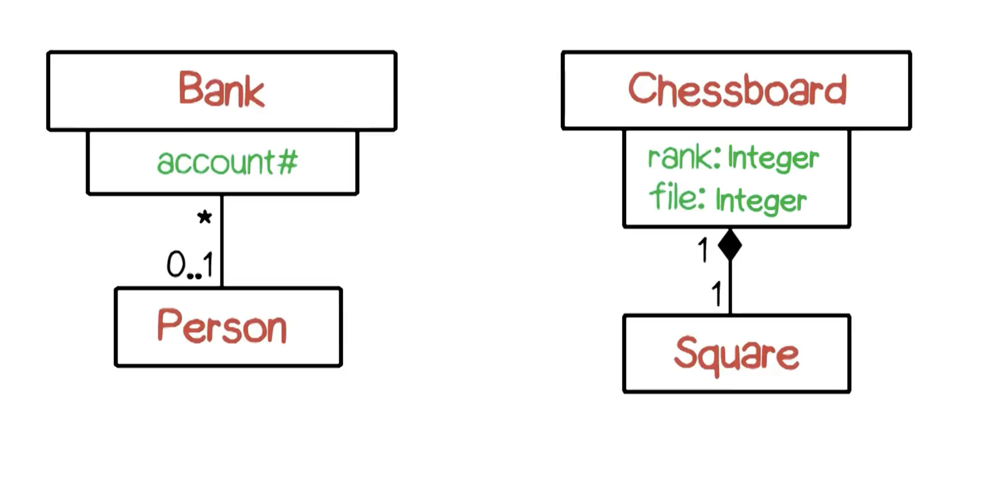
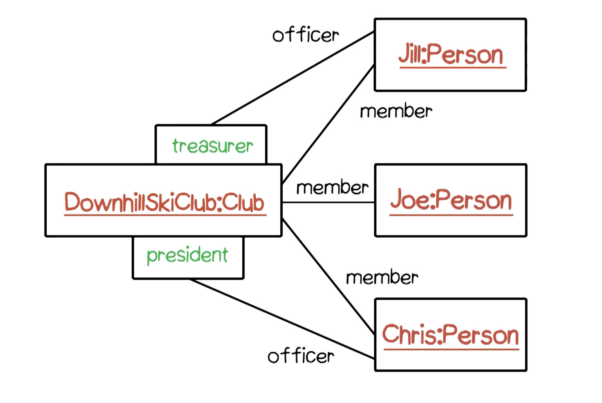
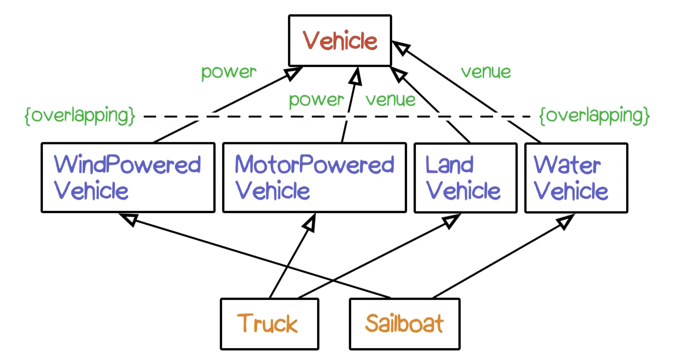
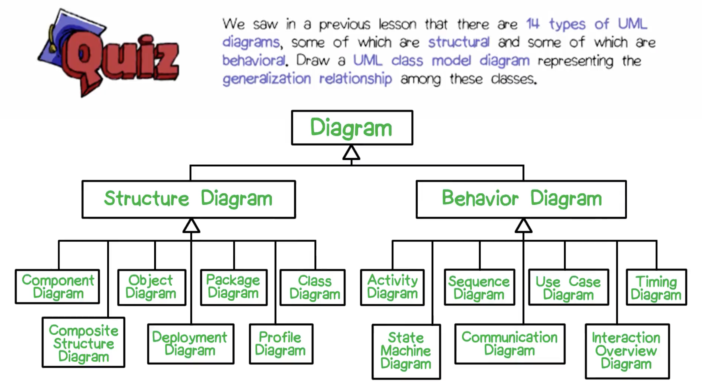

# UML Class Model
*Also called Static Stucture Diagrams*

## Classes

*Class names start with capital letter*
- Contains representations for:
	- Classes
	- Interfaces
	- Objects
	- Relationships
	- ...
- Represents
	- Domain objects
	- Roles
	- Events
	- Interactions
- Abstract class
	- Describe properties of subclasses
	- Never have instances
	- Specify by: using *italic* or tag
- Other affordances in name compartment:
	- Stereotypes
		- Extend base UM language
- Features
	*Classes exist in Real World; Features exist inside the Computer*
	- Attributes: instance variables
		- Attribute compartment:
			- Name
			- Type
			- Optional mutiplicity and ordering
			- Optional initial value
			- Optional derivation
			- Properties
	- Operations: methodss
		- Parameter list:
			- Name
			- Type
			- Default value
			- Kind (in, out, inout)
		- Properties
			- {query}
			- {concurrency}
			- {abstract}
			- Class Scope (shown by underline on the operation name)
- Advanced features
	- Interfaces
		- Icons for requires and provides
	- Parameterized classes
		- Correspond to Java generics / C++ templatees
		- Describe collection classes
	- Nested classes
		- Suitable for inner classes
	- Composite objects
		- Class diagrams within class rectangles
- Symbols for visibility
	- Public: +
	- Private: -
	- Protected: # (only sub-classes can access)
	- Packages: ~

## Relationship
- Association
- Generalization
- Dependency

### Associations

- Name
- Association classes
- Aggregation (open diamond) and composition (filled diamond)
- Reading direction (filled triangle)
- Navigability (arrowhead on one / both ends of association line): primary access pattern for those classes is in the direction of the arrow
- Multiplicity
	- \*: any number of instances (3..\*: 3 to any number of instances)
- Property (e.g. {ordered} the points are in a particular order)
- Role name at either or both ends of the association line
- Qualification
- Constraints

#### Association class

- Indicated by having a dashed line that abuts into the association line
*Recursive association: e.g. Job has association with itself*

#### Aggregation v.s. Composition association
-  Composition
	- In composition, there is a responsibility for managing the lifetime of the constituent objects
	- The particular onsituent can only belong to one composition
	- Compositions also have transitive property (e.g. House has room, room has closet)
- Aggregation
	- More general
	- Seperate lifetime

#### Qualifiers

#### Links

### Generalization

Subclass / child class ---|> Superclass / parent class
- All instances of subclass are also instances of parent class (subset relationship)
- Instances of subclass have to have all the properties of instances of parent class
- Generalization (modeling technique) is not the same as inheritance (implementation technique) in OOP
- UML generlization suppoerts multiple parent classes & multiple child classes
- Can specify discriminators (names of groups of subclasses)
- Properties
	- Overlapping / disjoint subclasses
	- Complete / incomplete subclasses

