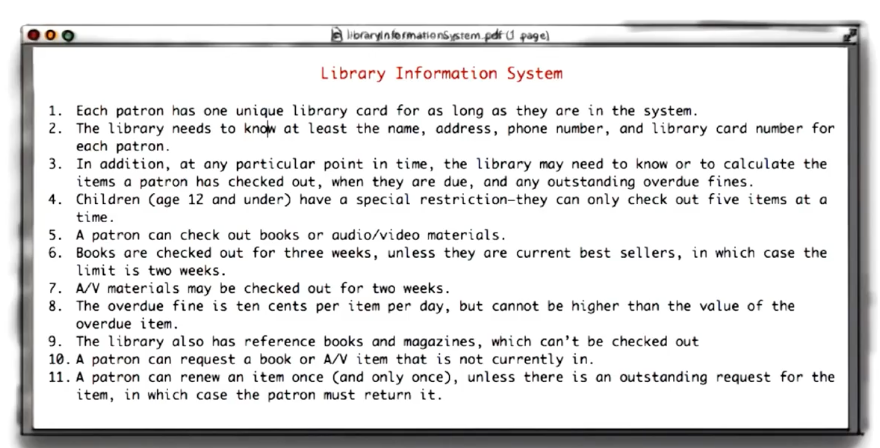
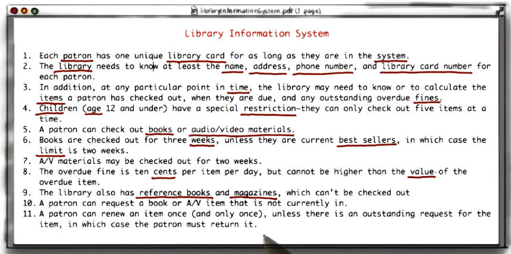
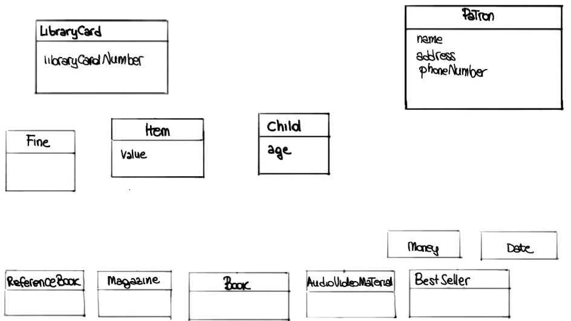
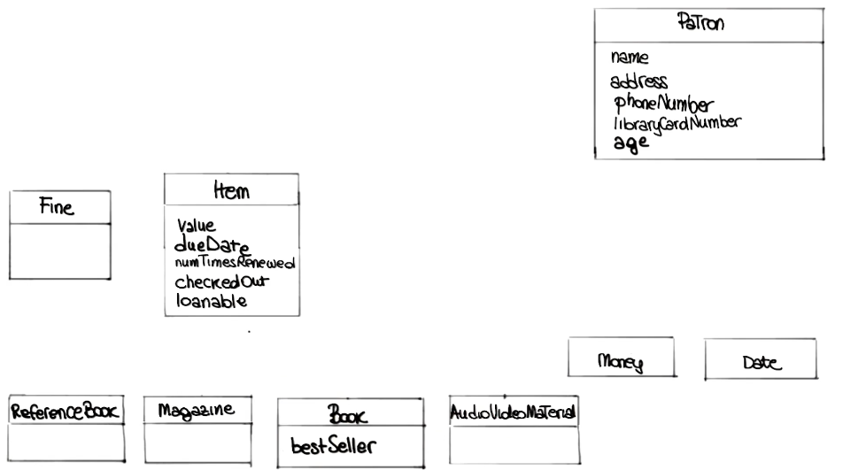
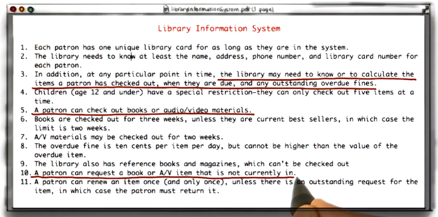
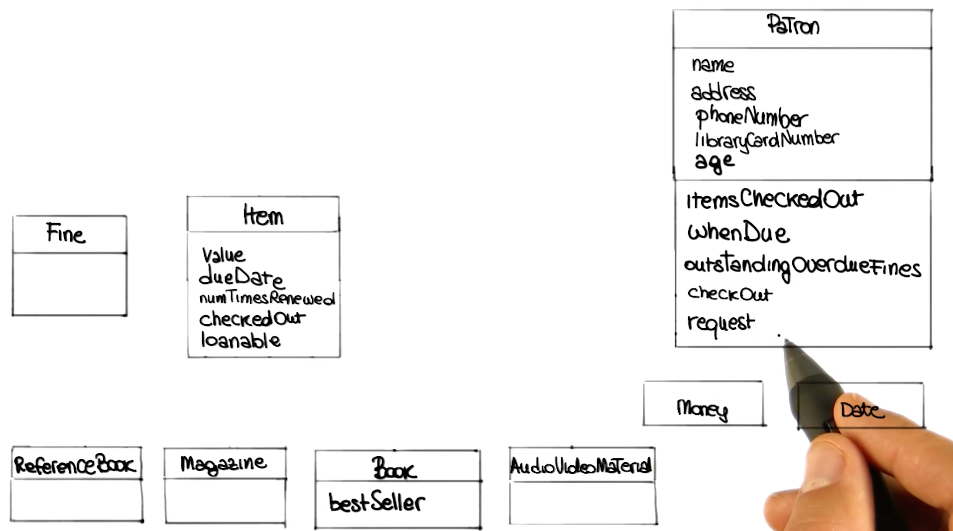
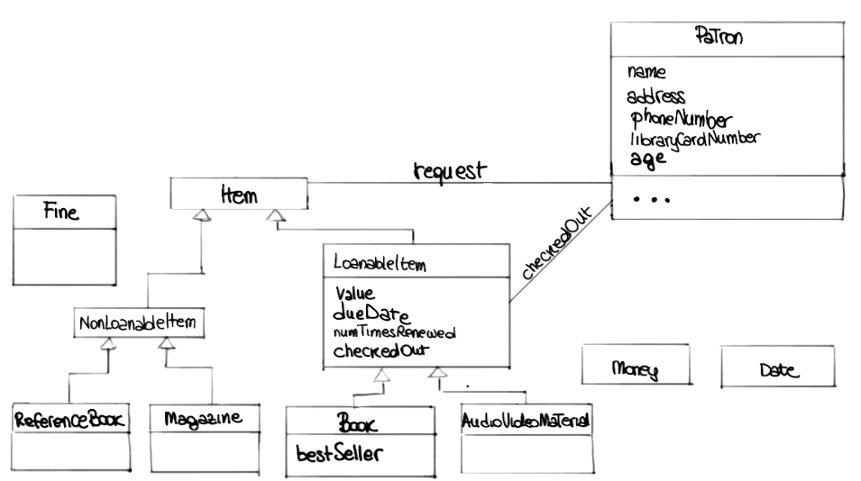
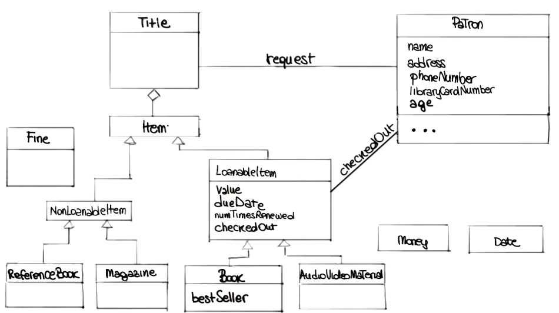
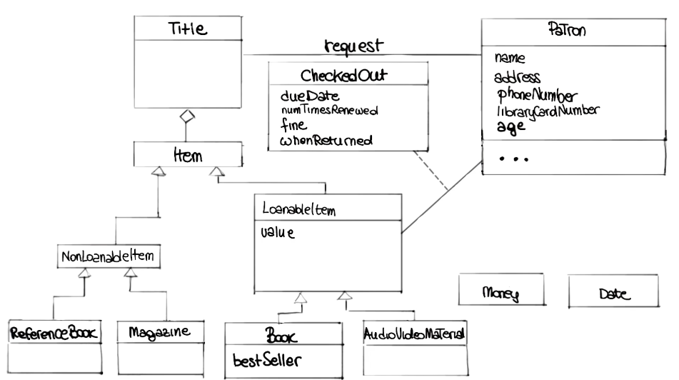
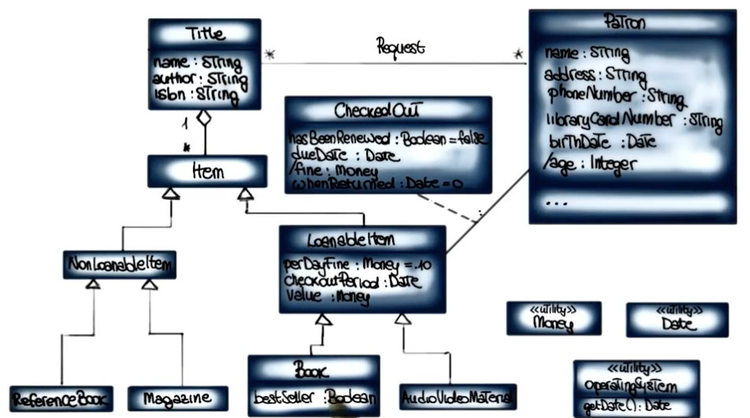

# Library Exercise (UML)

## Requirements

## Steps

### 1. Nouns - classes

### 2. Refinement: reduce classes

### 3. Refinement: add attributes

### 4. Action verbs - operations

### 5. Relationships - Association & Hierarchy

### 6. Refinement: title class
*What patrons request are titles, not items (each title can correspond to multiple items)*

### 7. Association class
*Move due date and renewed attribute to association class between patron and loanable item*

### 8. Final diagram
*Derived attributes (\attribute): attributes whose values are derived from other attributes*
*Cardinality: number correspondance for associations*

