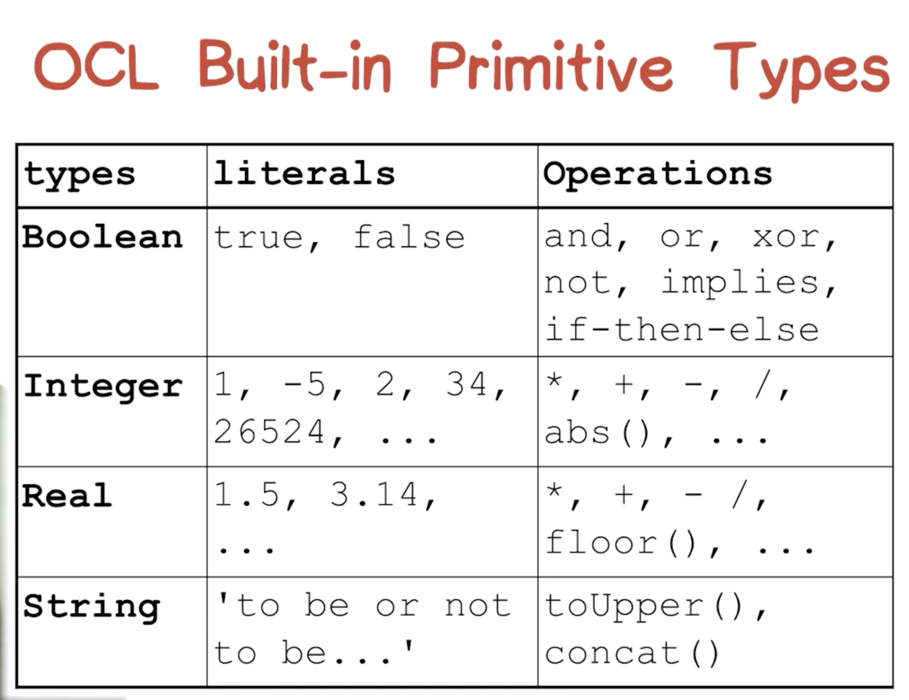
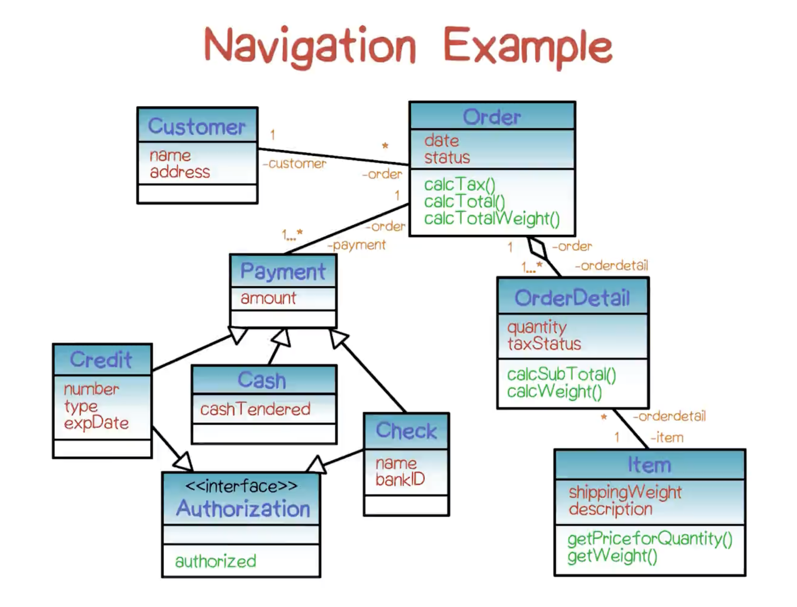

# Object Constraint Language (OCL)

## OCL
- Official part of UML
- Strongly typed, declarative specification of system properties
- Constraints + collection classes + UML diagram navigation
- Suppoted by: Rational Rose, ArgoUML, Eclipse, Poseidon/Octopus, Enterprise Architect

## Why do we need OCL?
- UML diagrams are limited in what they can express:
	- Structural relstionships, behavioral descriptions
	- However, there are times we need mechanism for specifying precise semantics
- OCL extends UML with:
	- Class invariants
	- Operation pre and post conditions
	- Guards on state-machine transitions

## OCL overview
- Declarative not procedural (for specifying properties)
	- Pure expression language (describe values, not describe activities)
	- No assignment statements or other side effects
- Strongly typed
	- Built-in types & types introduced in UML diagrams
- Highest level mechanism is the constraint
	- Constraint is formal assertion of system properties

## Uses of OCL
- To **specify invariants** on classes in the class model
- To **describe pre- and post- conditions** on Operations and Methods
- To **specify derivation rules** for derived attributes
- To **describe guards** on transitions in Statechart diagrsm
- To **specify targets** for messages and actions
- To **specify type invariants** for Stereotypes
- As a **query language**

## Syntax
```
context <identifier> <constraintType>: <Boolean expression>
```
- <identifier>: Gives a name to the context (where you are in a diagram, usually means a class, so it's the name of a class. It might be the name of a particular method in a class)
- <constraintType>: There are three kinds of constraints
	- Invariants
	- Preconditions
	- Postconditions
- <Boolean expression>: Actual constraint

## Types of constraints
- Invariants
	- Statement of a property that is always true
	- Expression of key system requirements
	- **inv** keyword
	- Example (in a large company, number of exployess must be greater than 50):
	```
	context LargeCompany
	inv: numberOfEmployees > 50
	```
	- Role of invariants: 
		- Concept of **integrity constraints** (relational database)
			- Properties of the data in the database that describe whether the database is sound
		- OCL invariant constraints
			- Play this role for system specification (prevents integrity violations)
- Pre and Post conditions
	- Used to express **Meaning** of **UML Operations**
	- **pre** condition: what must be true for the Operation to meaninfully take place
	- **post** condition: what is guarenteed to be true after the Operation completes
	- Example (square root):
		- precondition: "The argument to the square root routine must be non-negative"
		- postcondition: "The square of the computed result must equal the argument"
		```
		context Real::squareRoot() : Real
		pre: self >= 0
		post: self = result * result
		```
	- Changes to attribute values
		- Post-conditions can also be used to describe the retulst of changes in the values of an attribute
		- @ sign followed by pre: the value before the operation executed
		- Example (bank deposit): 
		```
		context Account::deposit(Real : amount)
		pre: amount > 0
		post: balance = balance@pre + amount
		```

## OCL Built-in Primitive Types


## OCL Keywords


#### Let clause
- Way of introducing an abbreviation / local definition into a constraint
- Has two parts: both expressions
- Example (income of salaries of all our jobs):
```
let income : Integre = self.job.salary->sum() in
	if isUnemployed then income < 100
	                else income >= 100
	endif
```

#### Navigation

- OCL constraints are associated with class model diagrams
- Each constraint specifies a context
- To refer to features of a non-context class in an OCL invariant, you must use a qualified name
- **Navigation** is done by walking through a diagram from the context class to the other class using intermediary relationship lines and class rectangles
- Navigation: multiciplicity
	- Associations can have multiplicity: 1-1 1-m m-n
	- When an association has multiplicity greater than one, the result is a collection rather than an individual object
	- If an Operation is performed, then the **->** symbol is used to separate the collection name from the Operation name
	- Example (with context class Custmoer, how would you refer to the size of the set of BankIDs that a Customer instance has wrriten checks on for all Orders that the Customer has made?):
	```
	self.Order.Check.bankID -> size()
	```

#### Collections
- OCL features four kinds of collections that support associations with many-to-many and one-to-many multiplicities
- Colelction provides features that hold true of all collections:
	- Size, includes, count, includesAll, isEmpty, notEmpty, sum, exists, forAll, iterate
	- Specizlized operations: Set, Bag, Sequence

#### Other OCL Features
- Tuple expression
- Enumerations
- Message expression denoting the sending of a signal or the invoking of an Operation
- Access to the UML metamodel
- Automatic flattening (set of sets / bags -> get one set in the end)


