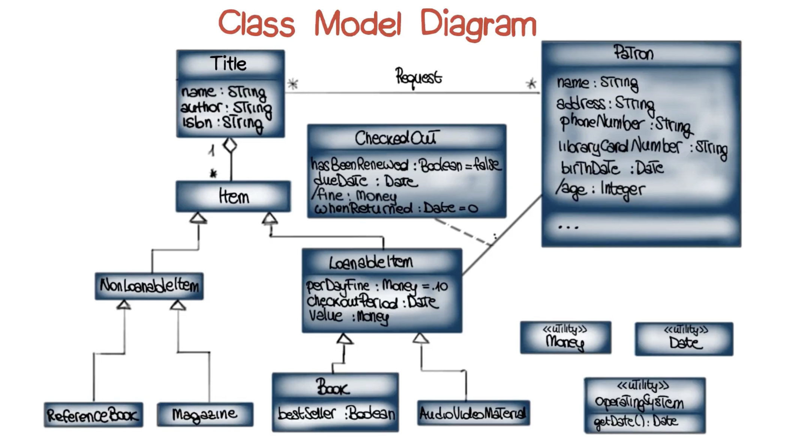

# Library Exercise (OCL)

## Library Problem Requirements (Class Model Diagram)
1. Each patron has one unique library card for as long as they are in the system.
2. The library needs to know at least the name, address, phone number, and library card number for each patron.
3. In addition, at any particular point in time, the library may need to know or to calculate the items a patron has checked out, when they are due, and any outstanding overdue fines.
4. Children (age 12 and under) have a special restriction-they can only check out five items at a time.
5. A patron can check out books or audio/video materials.
6. Books are checked out for three weeks, unless they are current best sellers, in which case the limit is two weeks.
7. A/V materials may be checked out for two weeks.
8. The overdue fine is ten cents per item per day, but it cannot go higher than the value of the overdue item.
9. The library also has reference books and magazines, which cannot be checked out.
10. A patron can request a book or A/V item that is not currently in.
11. A patron can renew an item exactly once-unless there is an outstanding request for the item in which case the patron must return it.


## Requirement #6
> Books are checked out for three weeks, unless they are current best sellers, in which case the limit is two weeks. </br>
- Determine the class to use: Book
- Determine the type of constraint: Invariant (describing properties of attributes that must always hold)
- Express constraint in OCL:
```
context Book inv:
  if bestSeller then
    checkoutPeriod = 2 -- weeks
  else
    checkoutPeriod = 3
  endif
```
- Explanation:
	- Text expresses a single constraint
	- this constraint is an invariant
	- OCL keywords: context, inv, if-then-else-endif
	- A comment is expressed by appending two dashes and some text
	- Each OCL constraint is interpreted in the context of a particular class
	- In the example the context is the Book class
	- All unqualified names (not referring to other classes - qualified names) appearing in the constraint are attributes of the Book class
	- Operations and associations may be similarly referenced
	- This particular constraint is a conditional


## Requirement #3
> In addition, at any particular point in time, the library may need to know or to calculate the items a patron has checked out, when they are due, and any outstanding overdue fines. </br>
- Operations:
	- Associated this rtext with an operation in class Patron called itemsCurrentlyCheckedout
	- Specify that the value computed by this operation in fact corresponds to just those items that are checked out for that Patron
```
context
  Patron::itemsCurrentlyCheckedOut() :
    Set(LoanableItem)
post:
  result = checkedOut.LoanableItem
```
- Explanation:
	- checkedOut.LoanableItem is an example of a compound name
	- OCL treats the names of these associations syntactically just like it would treat an attribute

## Requirement #4
> Children (age 12 and under) have a special restriction-they can only check out five items at a time. </br>
```
context Patron::checkOut(i : LoanableItem)
pre: age <= 12 implies
    itemCurrentlyCheckedOut() -> size() < 5
```
- Explanation:
	- Note that because this constraint is not a complete specification of checkOut, it contains no postcondition

*Side Effects*
- Specify an even more complex situation - one where an Operation actualy results in a change of state
- Pure function: don't have side effects

## Requirement #5
> A patron can check out books or audio/video materials. </br>
```
context Patron::checkOut(i : LoanableItem)
pre:
  i.isAvailable() and
  i.notRequestedBySomeoneElse(self) and
  (age <= 12 implies
  	itemsCurrentlyCheckedOut()->size() < 5)
```
- Explanation:
	- Precondition has three conjuncts
	- For the first and second condition, we have invented new Operations, to be defined in class LoanableItem
	- This is similar to what we do when writing a program and want to break up an algorithm into pieces
```
### Post condition #1
post:
  exists(c: CheckedOut |
  	c.loanableItem = i and 
  	c.dueDate = peratingSystem.getDate() + 
  	  c.loaableItem.checkoutPeriod and
  	checkedOut = checkedOut@pre->including(c)
  	)
```
- Explanation:
	- This postcondition has three clauses
	- The first clause (c.loanableItem = i) says that after execution of the CheckOutperation is complete there must exist an instance (c) whose corresponding LoanableItem is the argument of CheckOut (i)

```
context Patron::checkOut(i : LoanableItem)
post:
  let t : Title = i.title in 
    if t.requests.patron->includes(self)
    then
      requests = requests@pre->reject(title = t and patron = self)
    else
      true
    endif
```
- Explanation:
	- Let expression defines the new symbol and binds it during the scope of another expression (here is post condition)
	- If the particular has a request to the particular patron, we update the request association
	- reject(): remove those particular items in the list which has the following boolean to create a new set

## Derived attribute
```
### Get age of Patron
context Patron::age
  derived:
    OperatingSystem.getDate() - birthDate
```


