# Behavior Modeling

## Limits of structural models
- Structural models express properties that are always true
- Structural models fail to convey interesting behavioral aspects of systems

## State v.s. Event
- State
	- Abstract description of system values at a given time (e.g. It's raining outside)
	- State space: 
		- Set of all possible states
		- Increases multiplicatively (State explosion problem)
- Event
	- Single, instantaneous, noticeable occurrence (stimulus -> system respond to it)
	- Can be:
		- *Synchronous*: periodical intervals
		- *Asynchronous*: randomly occuring, bursts / spreadout
	- Stimulus for a change of state in a system
	- Triggers:
		- Results of actions
		- Data conditions
		- Passage of time
	- UML event taxonomy
		- **Signal**: asynchronous notification
		- **Method call**: synchronous operation invocation
		- **State change**: continuously monitored
		- **Time passage**

## Behavioral modeling
- Systems that respond to events: **reactive** systems
- Modeling techniques:
	- Combinatorial: states, but no events
		- Expresses logic of simple combinatorial systems
		- Only inputs determine subsequent states
		- Representation:
			- **Decision tables**
				- Condition: inputs
				- Responses: outputs
			- **Decision trees** (graphical form of decision table)
				- Diamonds <>: decisions
				- Rectangles []: actions
				- Archs ->: implications of decisions
	- Sequential: states, linearly ordered events
		- Sequential systems (Finite State Systems) - Finite State Machines
		- State Transition Table (STT)
			- Rows: sates
			- 4 columns: Name, Input event, Output actions, Next state
		- State Transition Diagrams (graphical representation of finite state machines)
			- Nodes (rectangle / oval)
			- Arches (state transition)
		- Problems with state transition diagrams:
			- Too many arrows (n * m)
			- Too many states (2^n)
			- No concept of abstraction / nesting
			- -> Partial solution: State charts (developed by David Harel)
		- E.g.: Garage door opening system (motor, buttom, door, sensors)
			- Possible states:
				- Door open, motor off
				- Door close, motor off
				- Door partially open, motor off
				- Door partially close, motor temporarily off
				- Door moving downward, motor on
				- Door moving upward, motor on
			- Possible events:
				- Button pressed
				- Door sensor up
				- Door sensor down
	- Concurrent: states, unconstrained events

*Decision table*
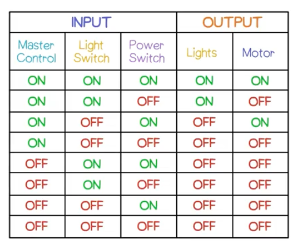

*Decision tree*
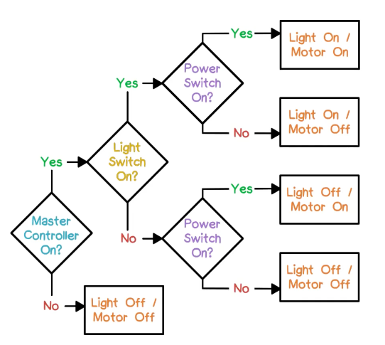

*STT for garage door opener*
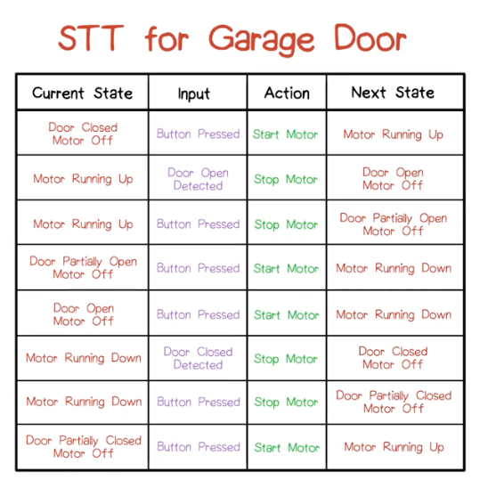

*State transition diagram for garage door opener*
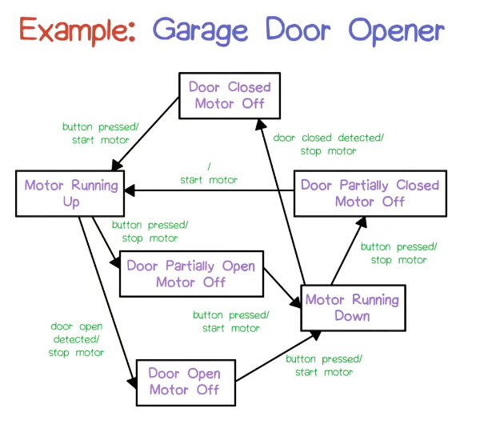

*State machine example: telephone*
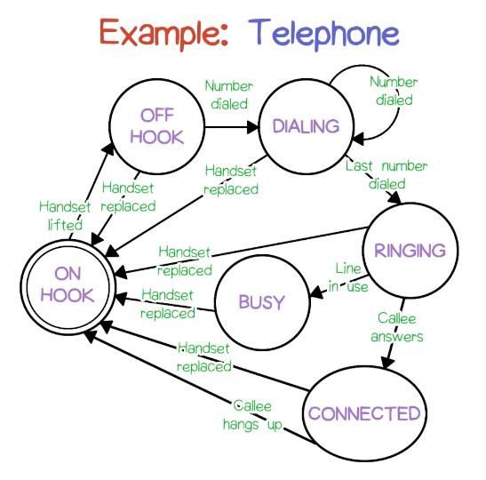

## State Chart
- Icons
	- Round tangles (rounded corner rectangles)
	- Default state & final state
- State Chart extsntions to FSM (final state machines):
	- Depth (nesting)
	- Concurrency
	- Broadcast events
	- Conditional transitions
	- Entry/exit actions/activities
	- Event parameters
	- History
	- Default states

*State chart icons*

*State chart icons: default state and final state*
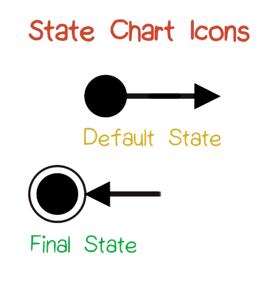

#### Nesting
*Without / with nesting (from Harel's paper)*
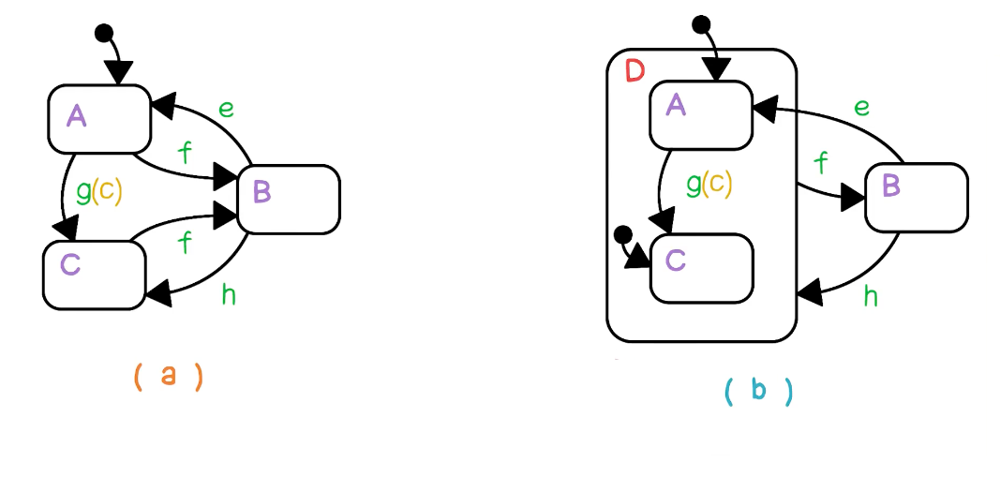

*UML Nesting: air conditioning*
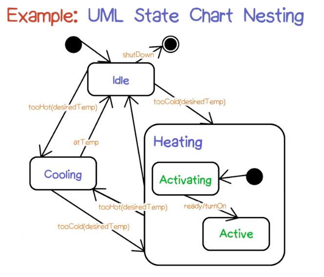

*UML Nesting: printer*
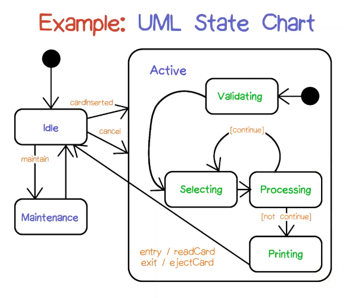

#### Concurrency
*Example: concurrency*
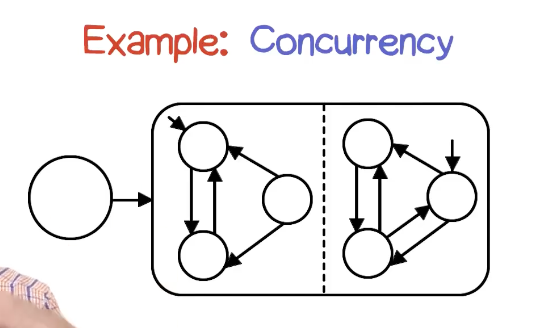

*Without / with concurrency (from Harel's paper)*
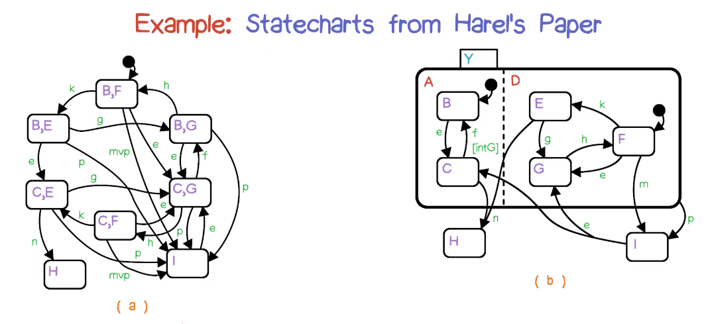

*UML concurrency example*
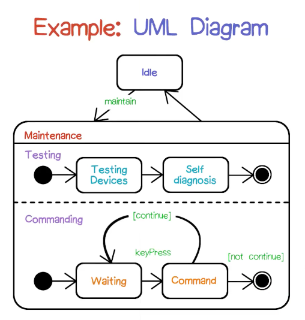

#### Synchronization
- Broadcast events
	- Indicated by slash (/) in transition events*
	- 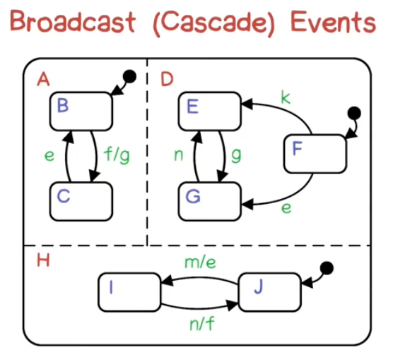

- Data conditions
	- Occur in square brackets,
	- Contains boolean expression over values of attributes
	- Continuously monitored
	- **In** and **Not in**

#### Transitions
*Special transitions*

*Example transition*
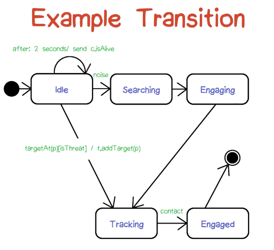

#### History states
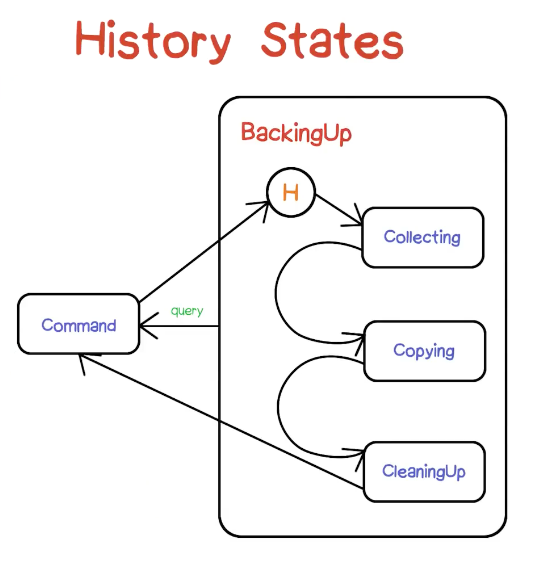

## Summary - UML state chart
*Action v.s. activity (activity takes time)*
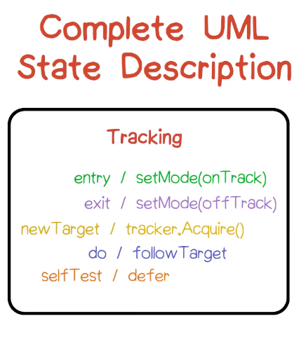

- UML transition description
	- Source state
	- Target state
	- Trigger event
	- Guard
	- Action
	- Forks and joins

## Relationship to class diagram
- Each class has attributes
- Attributes form state space
- Each class could have own state chart (most have relatively simple states, not needing state charts)
- In state charts:
	- **Attributes** are **attributes** of class
	- **Actions** are **methods** of class
	- **Events** are **signals** (dependency) of class model diagram

*Digital watch state chart (top level version)*
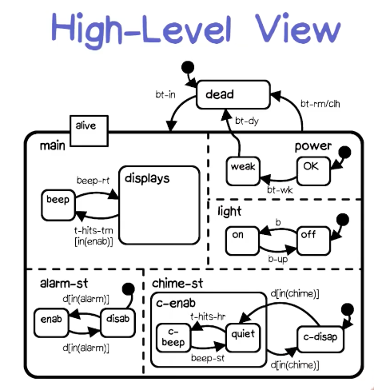

*Submachine of digital watch: stop watch*
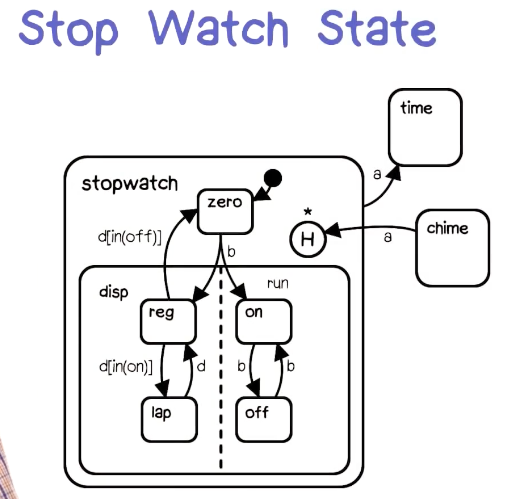

*Submachine of digital watch: display state*
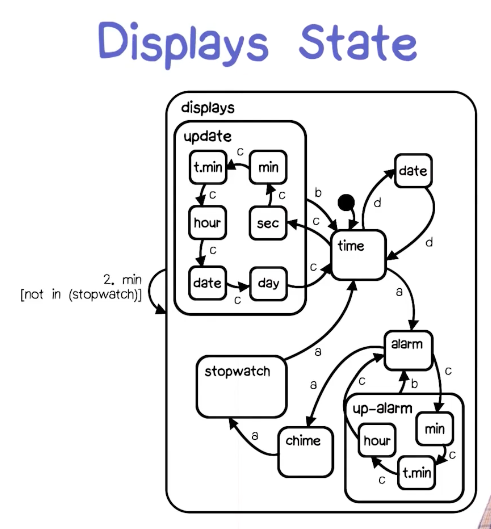

