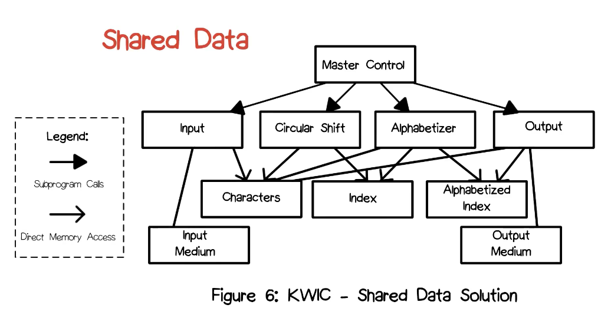
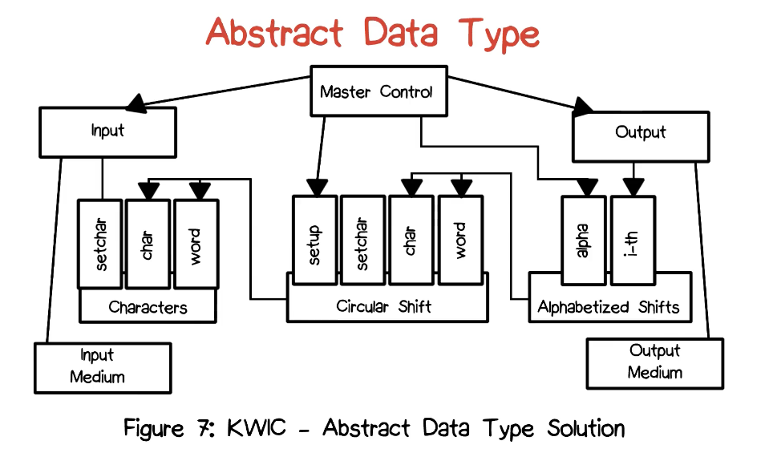
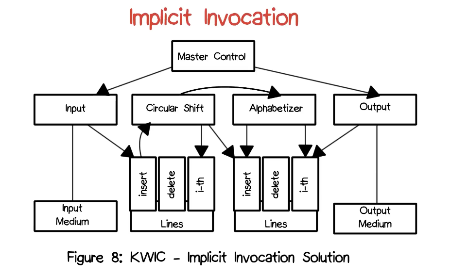

# KWIC Exercise

## KWIC (Key Word in Context Index) Exercise
- Paper by David Parnas
- Come up with four different architectures that address the same problem
- Design a program that produces a Key Word in Context Index

## KWIC
- KWIC index system accepts as input a sequnce of text lines
- A line may be circularly shifted by removing its first word and appending it at the end of the line
- KWIC index system outputs a listing of all circular shifts of all lines in alphabetics order of the keyword used to shift the line
- Idea: if you want to look up any of those titles, you can use any of the words that comprise the title to them

## Example of circular shifts
**Gone with the Wind**
- Gone with the Wind
- with the Wind Gone
- the Wind Gone with
- Wind Gone with the

*Alphabetic ordered*
- Gone with the Wind
- the Wind Gone with
- Wind Gone with the
- with the Wind Gone

## Box and arrow diagrams
- Break it up into component pieces
- Represent the architecture you come up with box and arrow diagram
	- Box: pieces and components
	- Lines: how they communicate
		- Control flow communication: A controls B
		- Data communication

## Solutions
### Shared Data Decomposition
- Break the system into components based on the functions they compute
- All components share access to the data
- Usually contains some form of master-controller routine responsible for invking others

### Pipe and Filter
- Break the system into independently executing coponents (filters)
- Connect the components together via FIFO queues (pipes)
- Each filter takes a single input (stdin) and produces a single output (stdout)
- The filters share the assumption that the inputs and output consist of sequential files containing lines of ASCII characters
- *Essential element: no common data storage elements*

### Abstract Data Types (ADT)
- Break the system into components based on important data structures
- Hide the representations of the data structures behind abstract interfaces
- The components holding the data structures also provide operations
- ADTs were a precursor to objects in object oriented languages

### Implicit Invocation
- Coordinate communication between components using registration-broadcast
- Servers do not know the identities of clients
- The unit of notification is the event

## Advantages and disadvantages
| Solutions | Advantage | Disadvantage |
| --- | --- | --- |
| Shared data decomposition | Easy data access, efficient and simplicity | Resiliance to changes in representation |
| ADT | Maintainability, reuse | Performance |
| Implicit invocation | Maintainability, Enhancements, data representation changes, reuse | Difficult to control / think about, inefficient |
| Pipe and filter | Intuitive, reuse | Interactivity, space efficiency |

## Questions
- Which of the four styles would be best able to deal with change having to do with the reusability of components?
	- Pipe and filter
- Which of the four styles would be least able to cope with change having to do with a different data representation?
	- Shared data decomposition
- Which of the four styles would be best able to deal with change having to do with interactive title deletion?
	- Abstract data type

## Take away
- A variety of different architectural styles can be used to solve a design problem
- A given style will have advantages and disadvantages depending on the particular requirement changes it must deal with

