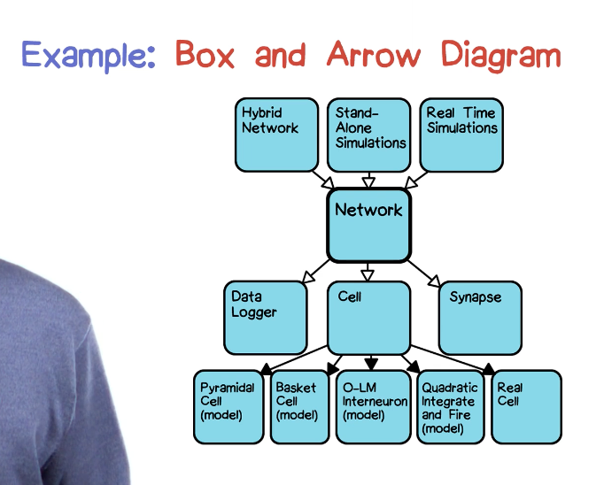
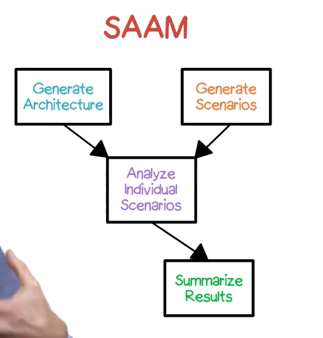

# Overvie of Architectural Styles

## Definition of software architecture
- Informal definition of software architecture
	- Organization of a system into component subsystems or modules
	- Iteratively refined into multiple layers
	- Often makes use of stereotypical architectural styles
- Formal definition of Architecture (USP definition)
	- The set of significant **decisions** about the organization of a software system, the selection of the **structural elements** and their **interfaces** by which the system is composed, together with their behavior as specified in the **collaborations** among those elements, the composition of these structural and behavioral elements into progressively larger subsystems, and the architectural **style** that guides this organization: these elements and their interfaces, their collaborations, and their composition. SOftware architecture is concerned not only with structure and behavior, but with **usage, functionality, performance, resilience, reuse, comprehensibility, economics and technology contraints and trade-offs, and aesthetic concerns.**
- Other definitions
	- Perry and Wolf: Elements + forms + rationale
	- IEEE: The fundamental organization of a system, embodied in its components, their relationships to each other and the environment, and the principles governing its design and evolution
	- Verhoff: The software architecture of a deployed software is determiend by those aspects that are the hardest to change
	- Garlan and Shaw: Components + connectors + configurations
		- Components: computational or data element plus interface to the rest of the system
		> Taylor et al.: A software component is an architectural entity that (1) encapsulates a subset of the system's functionality and/or data, (2) restricts access to that subset via an explicitly defined interface, and (3) has explicitly defined dependencies on its required execution context.  
		> Szyperski: A software component is a unit of composition with contractually specified interfaces and explicit context dependencies only. A software component can be deployed independently and is subject to composition by third parties.
		- Connector: communication protocals among components (protocal between components)
		> Taylor et al.: A software connector is an architectural element tasked with effecting and regulating interactions among components.
			- Examples: procedure call / return (pair of messages; asymmetric, asynchronous; typed parameters and return value; two roles: caller and callee)
		- Configurations: components hooked up with connectors (topology)
		> Taylor et al.: An architectural configuration is a set of specific associations between the components and connectors of a software system's architecture

#### Question: Analysis models
- Can adapt well to changes in customer requirements: 
	- True
- Should represent the approach that will be taken in design: 
	- False (we want to avoid mixing analysis and design together or else we might bias the design approach that is taken)
- Are resilient to changes in hardware:
	- True
- Includes all components required by a system 
	- False (there will likely be additions to a system that analysis model will not specify)

## Selecting components
- Required functionality
- Existing reusable components
- Physical machine architecture
- Expertise of staff
- Conway's Law
- Projected evolution trajectories

## APIs
- Application Programming Interface
- Names of access ports, arguments, types
- Can be described in a specific programming language (language binding)
- Might be described in OCL
- ADLs - Architectural Description Languages

## Terminology
- Coneceptual architecture (vague and high level)
- As-Intended v.s. As-Built architecture 
- Architectural drift (As-Itended -> As-Built)
- Architectural erosion (drift during maintenance stage)

## Architectural views
- The architecture of a system comprises all of the decisions controlling how a specified problem solution is realized
- Because this set of decisions may be quite large and eclectic, various architectural diagrams are used to convey some portion of them

#### Question: UML diagrams that can be used to convey architectural views:
Class model, Component Diagram, Deployment Diagram, Object Diagram, Package Diagram, Use Case Diagram, Sequence Diagram, Communication Diagram, Interaction Overview Diagram

## Architectural Styles
- Definition: **Named collections of architectural design decisions** that (1) are applicable in a given development context, (2) constrain architectural design decisions that are specific to a particular system within that context, and (3) elicit beneficial qualities in each resulting system. - Taylor et al.
- Benefits:
	- Encoded experience
		- Standards: validation; selection criteria
		- Reuse
		- Support of process
- Catalog of architectural styles:
	- Abstract data type: ADT, hide representation
	- Blackboard: repository, opportunistic control, cooperating agents
	- Big ball of mud: Monolithic
	- Client-server
	- Component-based: useable modules communicating through well-defined interfaces
	- Coroutines: symmetric interaction
	- Data centric: use of stored database procedure
	- Domain Driven Design (DDD): business-oriented, domain model
	- Implicit invocation: events, callbacks, registration-broadcast
	- Layered: virtual/abstract machines, limited visibility
	- Master control hierarchial call and return
	- Message Bus: asynchronous message passing over a common bus
	- Mobile code: code on demand, remote evaluation, mobile agent
	- Peer-to-peer: equal partners sharing responsibilities
	- Object-oriented: asynchronous message passing, independent threads of control
	- Plugins: registry plus third party add-ons
	- Pipe and filter: one-way, sequential, stdin-stdout, ASCII streams
	- Process control: with feedback loop
	- Production systems: rule based, conditional firing
	- Representational state transfer (REST): client-server, layered, stateless, cacheable distributed hypermedia
	- Service-Oriented (SOA): loosely coupled, stateless, discoverable, contract-specified
	- Shared Nothing (Sharded): distributed database with no sharing across nodes
	- State-transition systems: reactive, real-time
	- Shared memory: with locks for synchronization
	- Table-driven interpreter: parse and dispatch
- Style Issues:
	- Some systems have more than one style
		- Heterogeneous
	- Some situation are very domain specific
		- Domain-specific software architecture (DSSA, sometimes called reference architecture)
	- Sematics
		- As the field of software architecture evolves, it's important to get more and more precise definitions of what these styles mean
- Architecture Description Language
	- Notation for describing architecture
	- Formality and precision
	- Prerequisite for tool support
		- Diagrammers, analyzers, simulators
	- Acme, Write, Rapide, ArTek, Demeter, CODE, Modecart, PSDL/CAPS, Resolve, UniCon

## Architectural Evaluation
- Systematic assessment of architecture properties
- Approaches:
	- Architecture review boards: stake holder review
	- Evaluation techniques:
		- Informal: Software Architecture Assessment Method (SAAM)
		- Formal: Architecture Tradeoff Analysis Method (ATAM)

