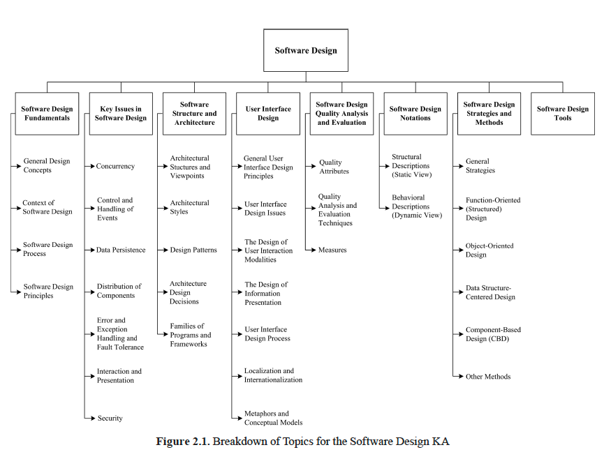

# Chapter 2 Software Design

## Acronyms
| Acroym | - |
| --- | --- |
| ADL | Architecture Description Language |
| CBD | Component-Based Design |
| CRC | Class Responsibility Collaborator |
| DFD | Data Flow Diagram |
| ERD | Entity Relationship Diagram | 
| IDL | Interface Description Language |
| MVC | Model View Controller |
| OO | Object-Oriented |
| PDL | Program Design Language |

## Introduction
#### Design definition
- Design is defined as both "the process of defining the architecture, components, interfaces, and other characterisitcs of a system or component" and "the result of [that] process"
- Viewed as a process, software design is the software engineering life cycle activity in which software requirements are analyzed in order to produce a description of the software’s internal structure that will serve as the basis for its construction
- A software design (the result) describes the software architecture — that is, how software is decomposed and organized into components—and the interfaces between those components. It should also describe the components at a level of detail that enables their construction.

#### Software design
In a standard list of software life cycle processes, such as that in ISO/IEC/IEEE Std. 12207, *Software Life Cycle Processes*, software design consists of two activities that fit between software requirements analysis and software construction:
- Software architectural design (sometimes called high-level design): develops top-level structure and organization of the software and identifies the various components.
- Software detailed design: specifies each component in sufficient detail to facilitate its construction.

#### Software Design knowledge area (KA)
- D-design (decomposition design) [Tom DeMarco]: map software into component
pieces.
- FP-design (family pattern design): establish exploitable commonalities in a family of software products
- I-design (invention design): usually performed during the software requirements process with the goal of conceptualizing and specifying software to satisfy discovered needs and requirements

## Breakdown of topics for software design
### 1. Software Design Fundamentals
#### *1.1 General Design Concepts*
In the general sense, design can be viewed as a form of problem solving. For example, the concept of a wicked problem—a problem with no definitive solution—is interesting in terms of understanding the limits of design. A number of other notions and concepts are also of interest in understanding design in its general sense: goals, constraints, alternatives, representations, and solutions (see Problem Solving Techniques in the Computing Foundations KA).
#### *1.2 Context of Software Design*
Software design is an important part of the software development process. To understand the role of software design, we must see how it fits in the software development life cycle. Thus, it is important to understand the major characteristics of software requirements analysis, software design, software construction, software testing, and software maintenance.
#### *1.3 Software Design Process*
Software design is generally considered a two-step process:
- Architectural design (also referred to as highlevel design and top-level design) describes how software is organized into components.
- Detailed design describes the desired behavior of these components.
The output of these two processes is a set of models and artifacts that record the major decisions that have been taken, along with an explanation of the rationale for each nontrivial decision. By recording the rationale, long-term maintainability of the software product is enhanced.
#### *1.4 Software Design Principles*
A principle is “a comprehensive and fundamental law, doctrine, or assumption”. Software design principles are key notions that provide the basis for many different software design approaches and concepts. Software design principles include **abstraction; coupling and cohesion; decomposition and modularization; encapsulation/ information hiding; separation of interface and implementation; sufficiency, completeness, and primitiveness; and separation of concerns.**

### 2. Key Issues in Software Design
#### *2.1 Concurrency*
Design for concurrency is concerned with decomposing software into processes, tasks, and threads and dealing with related issues of efficiency, atomicity, synchronization, and scheduling.
#### *2.2 Control and Handeling of Events*
This design issue is concerned with how to organize data and control flow as well as how to handle reactive and temporal events through various mechanisms such as implicit invocation and call-backs.
#### *2.3 Data Persistence*
This design issue is concerned with how to handle long-lived data.
#### *2.4 Distribution of Components*
This design issue is concerned with how to distribute the software across the hardware (including computer hardware and network hardware), how the components communicate, and how middleware can be used to deal with heterogeneous software.
#### *2.5 Error and Exception Handeling and Fault Tolerance*
This design issue is concerned with how to prevent, tolerate, and process errors and deal with exceptional conditions.
#### *2.6 Interaction and Presentation*
This design issue is concerned with how to structure and organize interactions with users as well as the presentation of information (for example, separation of presentation and business logic using the Model-View-Controller approach). Note that this topic does not specify user interface details, which is the task of user interface design (see topic 4, User Interface Design).
#### *2.7 Security*
Design for security is concerned with how to prevent unauthorized disclosure, creation, change, deletion, or denial of access to information and other resources. It is also concerned with how to tolerate security-related attacks or violations by limiting damage, continuing service, speeding repair and recovery, and failing and recovering securely. Access control is a fundamental concept of security, and one should also ensure the proper use of cryptology.

### 3. Software Structure and Architecture
In its strict sense, a software architecture is “the set of structures needed to reason about the system, which comprise software elements, relations among them, and properties of both”.
#### *3.1 Architectural Structures and Viewpoints*
Different high-level facets of a software design can be described and documented. These facets are often called views: “A view represents a partial aspect of a software architecture that shows specific properties of a software system”. Views pertain to distinct issues associated with software design—for example, the logical view (satisfying the functional requirements) vs. the process view (concurrency issues) vs. the physical view (distribution issues) vs. the development view (how the design is broken down into implementation units with explicit representation of the dependencies among the units). Various authors use different terminologies—like behavioral vs. functional vs. structural vs. data modeling views. In summary, a software design is a multifaceted artifact produced by the design process and generally composed of relatively independent and orthogonal views.
#### *3.2 Architectural Styles*
An architectural style is “a specialization of element and relation types, together with a set of constraints on how they can be used”. An architectural style can thus be seen as providing the software’s high-level organization. Variou authors have identified a number of major architectural styles:
- General structures (for example, layers, pipes and filters, blackboard)
- Distributed systems (for example, clientserver, three-tiers, broker)
- Interactive systems (for example, Model-View-Controller, Presentation-Abstraction-Control)
- Adaptable systems (for example, microkernel, reflection)
- Others (for example, batch, interpreters,
#### *3.3 Design Patterns*
Succinctly described, a pattern is “a common solution to a common problem in a given context”. While architectural styles can be viewed as patterns describing the high-level organization of software, other design patterns can be used to describe details at a lower level. These lower level design patterns include the following:
- Creational patterns (for example, builder, factory, prototype, singleton)
- Structural patterns (for example, adapter, bridge, composite, decorator, façade, flyweight, proxy)
- Behavioral patterns (for example, command, interpreter, iterator, mediator, memento

#### *3.4 Architecture Design Decisions*
#### *3.5 Families of Programs and Frameworks*

### 4. User Interface Design

#### *4.1 General User Interface Design Principles*
#### *4.2 User Interface Design Issues*
#### *4.3 The Design of User Interaction Modalities*
#### *4.4 The Design of Information Presentation*
#### *4.5 User Interface Design Process*
#### *4.6 Localization and Internationalization*
#### *4.7 Metaphors and Conceptual Models*

### 5. Software Design Quality Analysis and Evaluation

#### *5.1 Quality Attributes*
#### *5.2 Quality Analysis and Evaluation Techniques*

### 6. Software Design Notations
#### *6.1 Structural Descriptions (Static View)*
#### *6.2 Behavioral Descriptions (Dynamic View)*

### 7. Software Design Strategies and Methods
#### *7.1 General Strategies*
#### *7.2 Function-Oriented (Structured) Design*
#### *7.3 Object-Oriented Design*
#### *7.4 Data Structure-Centered Design*
#### *7.5 Component-Based Design (CBD)*
#### *7.6 Other Methods*

### 8.Software Design Tools

